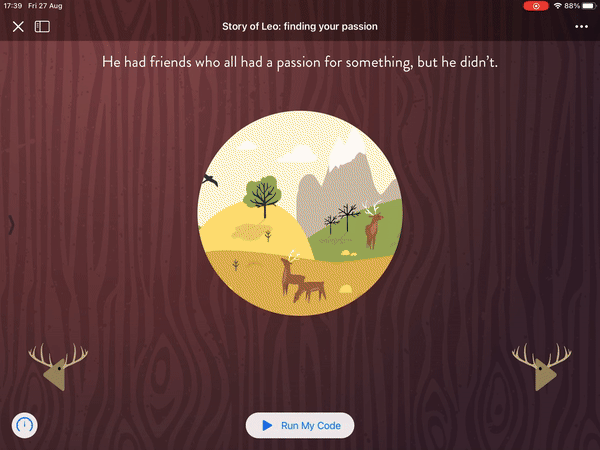

# Leo: embark with Leo on a journey to find his passion.

This app tells the story of Leo, an animal on a journey to discover his passion, using custom animations, sounds, and handmade visuals to create an emotional experience.

* Written in Swift and UIKit
* Awarded by Apple for the WWDC Scholarship 2017
* Auto Layout was written entirely with code

## Description
My playground tells the story of an animal called Leo who travels the world to find his passion, which drives one to do incredible things. I decided to create this experience because I am a strong believer that playgrounds aren't just great ways to learn to code, but also to tell stories. This playground relates to my very own story of finding my passion for programming. Sounds and handmade images evoke emotions and immerse the user in the story.

I used many Apple technologies throughout the app, such as UIKit, QuartzCore and AVFoundation to reproduce sounds. I also created a background class so that every page inherits the same wooden background. I implemented a custom controller, which continuously displays raindrops by UIGravityBehavior and UIDynamicAnimator, and the rain animation automatically adapts to the size of the view. I customized properties such as the rain color and frequencies in the RainView class.

I developed a class that makes leaves fall down the screen, creating a magical effect by using a CAEmitterLayer and CAEmitterCell. I defined several properties to manage how many leaves are displayed at once in the main view. I also think animations are a big component of successful apps and playgrounds. I assigned a spring-style animation to the button of the first page to make the navigation of the app easier, so that the user knows what to do next. I wrote a function to also set the wobbliness of the spring animation (the closer the value to zero the shakier the animation). Another function, called initialSpringVelocity, defines how quickly the animation shoots out in the beginning. This class hasn’t wasn't just used to generate leaves, but also the hearts at the end of the playground.

In the first page, I introduce the topic of the playground so that the user has a basic idea of what the story is going to be about. Great care was taken to craft a beautiful looking interface. I designed the navigation buttons to resemble a deer, which is the main character of the story. Pressing a button also plays a sound, which makes the whole experience magical, because it feels like touching real wood.

I created a gorgeous mix of audio tracks to evoke the emotions one would feel adventuring in the night, in a dark forest, or in the heavy rain. I have a strong passion for design, so every handmade image was created to represent the story exactly how I imagined it. For instance, the rain animation and custom sounds make the user actually "feel" the rain like never before. And at the end of the story, the playground ends in a waterfall of hearts, thanking the user for reaching the end of the experience. 

